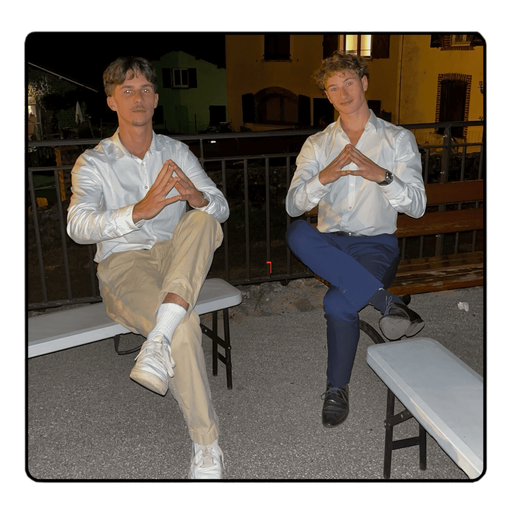

# 🇫🇷 Marrant Club : Le Tour de France des Défis



Bienvenue sur le dépôt officiel du **Marrant Club** ! 
Notre mission : Parcourir les **96 départements français** et relever un défi loufoque dans chacun d'entre eux. 

🚀 **Site propulsé par [Vercel](https://vercel.com)**

---

## 🌟 Le Concept
Le Marrant Club, c'est deux potes, une voiture, et une France remplie de défis. De l'**Ain (01)** au **Val-d'Oise (95)**, nous suivons les suggestions de notre communauté pour créer du contenu unique et mémorable.

### Nos Partenaires Officiels
*   🌱 **HappyVore** : Pour l'énergie végétale durant nos trajets.
*   🚄 **TGV INOUI** : Notre partenaire logistique pour traverser les régions.

---

## 🛠️ Fonctionnalités du Site
- **Carte Interactive** : Suivi en temps réel de notre progression (SVG dynamique).
- **Le Mur des Défis** : Galerie des vidéos YouTube de chaque exploit (via IDs d'intégration).
- **Soumission de Défis** : Formulaire intelligent avec liste complète des départements (01 à 96).
- **Back-end Serverless** : Gestion des envois via les fonctions API de Vercel.

---

## 💻 Installation Locale

Si vous voulez contribuer ou tester le projet sur votre machine :

1. **Cloner le projet**
   ```bash
   git clone [https://github.com/votre-compte/marrantclub.git](https://github.com/votre-compte/marrantclub.git)
